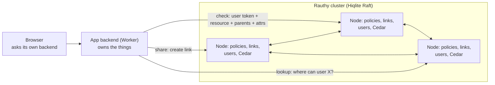

<!-- .plans/cedar-research.md -->

# Better Auth vs Rauthy + Cedar: an honest comparison

Research, 2026-10-10, for remy-auth. The plan it serves is [cedar.md](cedar.md); read that for what remy-auth
does with it. This file is the research as it was done, kept whole so the plan can be checked against it.
It was written before reading remy-auth's code, so "your Worker" below is any Remy app's Worker, and the
relation engine remy-auth already has is what the research calls "structural relations in the app's database".

## What this document is for

Three questions, answered as honestly as the evidence allows:

1. **If Cedar were fully built into Rauthy, how would it compare with Better Auth?** Better Auth already does both authentication and authorization, so it is the fair benchmark.
2. **Which should you use, and when?**
3. **Could Rauthy, with its Raft cluster, run on Cloudflare next to your Workers?** That would be the best of both worlds: Cloudflare's edge for the apps, Rauthy for identity and permissions.
4. **What about Rauthy unchanged, with Cedar in your Worker?** Two separate things working together. This was the first idea in this thread, set aside for its integration gaps. Those gaps are listed and weighed in [Rauthy unchanged + Cedar in your Worker](#rauthy-unchanged--cedar-in-your-worker).

The Rauthy + Cedar design is described in enough detail to judge it and, if wanted, to build it. It is a proposal, not a feature that exists.

**How to read it.** Every factual statement about Rauthy, Hiqlite, Cedar, Better Auth or Cloudflare links to its source where it is made. Rauthy links point at commit [`875f0d6`](https://github.com/sebadob/rauthy/blob/875f0d6) so the line numbers stay valid. Everything else is marked:

- **Proposal:** a design choice this document suggests, not a claim about existing software.
- **Our view:** a judgement. You may disagree.

**Words.**

- **App** or **backend:** the server side of an application. On Cloudflare that is a **Worker**. "The app sends", "the app's database" always mean the backend.
- **Browser:** code on the user's device. It never decides permissions, because the user can change anything there. It only asks the backend what is allowed, to show or hide buttons.
- **Rauthy:** the identity server. In this proposal it also stores policies and answers permission checks.
- **Cedar:** the policy language and engine. It runs wherever the policies are: in Rauthy, or in your Worker.

## The verdict

| Your situation | Use | Where Cedar runs | Where rules and share links live |
| --- | --- | --- | --- |
| One TypeScript app, organization roles are enough | **Better Auth alone** | Nowhere | Better Auth's role tables |
| TypeScript apps on Workers that need sharing, folder inheritance, deny rules or "what can I see" | **Better Auth + Cedar in your Worker** | Your Worker, as WASM | Your database (D1, SQLite, Durable Object), next to your data |
| Rauthy's identity (audited, central OIDC, any language) plus real ReBAC now, without changing Rauthy | **Rauthy unchanged + Cedar in your Worker** | Your Worker, as WASM | Your database, next to your data. Users and groups pushed in by Rauthy's SCIM |
| Many apps in several languages, one place for identity, permissions and audit | **Rauthy + Cedar built in** | Rauthy | Rauthy's Hiqlite cluster |

- **Available today:** the first three. Rauthy + Cedar built in must be built, upstream or in a fork, plus four smaller Rauthy changes listed in [What Rauthy would need](#what-rauthy-would-need-to-change).
- **Is Rauthy + Cedar better?** As a central platform for many apps, yes. It is the only option here with one policy store, login facts filled in by the identity server itself, live proof of what a policy change does, and an independent security audit. For a single TypeScript stack on Workers it is not better: it adds a network hop and a server to run, and it does not exist yet.
- **Rauthy unchanged + Cedar in your Worker** is the realistic way to have Rauthy today. Checks never leave the Worker; Rauthy is only on the login path. Its gaps are real but each has a workaround, listed below.
- **Rauthy on Cloudflare:** a single node could run in a Cloudflare Container with care, but a Raft cluster cannot as the platform is documented today. Details in [Running Rauthy on Cloudflare](#running-rauthy-on-cloudflare).
- **Path that keeps every door open:** build Better Auth + Cedar in your Worker now, using the schemas, templates, link table and tests in this document. The rules are identical in both designs, so they move into Rauthy later without a rewrite.

In every option the browser only asks its backend what is allowed. The backend makes the real decision when the user acts.

## The two candidates

### Better Auth

A TypeScript auth framework with a large plugin set, version 1.7.7 at the time of writing ([Better Auth plugins](https://better-auth.com/docs/concepts/plugins)). It runs on Cloudflare Workers through Hono with the `nodejs_compat` flag ([Hono integration](https://better-auth.com/docs/integrations/hono)) and supports SQLite/D1, PostgreSQL, MySQL and MSSQL ([Database](https://better-auth.com/docs/concepts/database)).

**Authentication** ([plugin list](https://better-auth.com/docs/plugins/admin)): Two Factor, Passkey, Magic Link, Email OTP, Phone Number, Username, Anonymous, Generic OAuth, One Tap, Sign In With Ethereum. Enterprise: SSO, SCIM, Device Authorization, Multi Session, JWT, Bearer, API Key, MCP. An **OAuth 2.1 Provider** plugin turns it into an OIDC provider for other apps, with ID tokens, discovery, JWKS, back-channel logout and DPoP ([OAuth 2.1 Provider](https://better-auth.com/docs/plugins/oauth-provider)). **Agent Auth** does capability-based authorization for AI agents; its docs call the standard unstable ([Agent Auth](https://better-auth.com/docs/plugins/agent-auth)).

**Authorization:**

- **Organization plugin.** Default roles owner, admin, member. You declare resource types and actions, such as `project: ["create", "share", "update", "delete"]`, build roles from them, and check with `hasPermission({ project: ["create"] })` ([Organization: Access Control](https://better-auth.com/docs/plugins/organization)).
- **Dynamic access control.** Organizations create roles at runtime in an `organizationRole` table. Nobody can grant more than their own role has ([Organization: Dynamic Access Control](https://better-auth.com/docs/plugins/organization)).
- **Teams** inside an organization, with their own management permissions ([Organization: Teams](https://better-auth.com/docs/plugins/organization)).
- **Admin plugin:** global roles, ban, impersonation, session revocation ([Admin](https://better-auth.com/docs/plugins/admin)).
- **Helpers:** `requireResourceOwnership` and `requireOrgRole` ([Plugins: helpers](https://better-auth.com/docs/concepts/plugins#requireresourceownership)).

**Security:** no independent audit found. The repo publishes advisories, including a critical API-key bypass fixed in 1.3.26 ([Better Auth security](https://github.com/better-auth/better-auth/security); [CVE-2025-61928](https://www.wiz.io/vulnerability-database/cve/cve-2025-61928)).

### Rauthy + Cedar

**Rauthy** is a Rust OIDC identity provider. It has passkeys, MFA, magic links, upstream providers, custom roles, groups, scopes and user attributes, a per-client group prefix, events and alerting, PAM/NSS Linux logins and `forward_auth` ([Rauthy features list](https://github.com/sebadob/rauthy#features-list)). It was audited by Radically Open Security ([Rauthy README](https://github.com/sebadob/rauthy#rauthy)). It runs on **Hiqlite**, a Raft-replicated SQLite, by default, with Postgres as an alternative ([Rauthy README](https://github.com/sebadob/rauthy#highly-available); [Hiqlite](https://github.com/sebadob/hiqlite)). It is maintained mostly by one person in their free time ([Rauthy: Support](https://github.com/sebadob/rauthy#support)).

What Rauthy lacks is authorization beyond roles and groups in tokens. Each app turns those claims into decisions itself. That answers "is this user an admin?", not "can Alice edit document 42?".

**Cedar** is AWS's open-source policy language and engine:

| Property | Source |
| --- | --- |
| Rust crate, Apache-2.0; WASM bindings for JS/TS | [`cedar-policy`](https://docs.rs/crate/cedar-policy/4.11.1/source/src/lib.rs); [Cedar repo](https://github.com/cedar-policy/cedar) |
| Default deny; `forbid` always beats `permit`; responses name the deciding policies and any errors | [Cedar: Authorization](https://docs.cedarpolicy.com/auth/authorization.html) |
| Semantics proven in Lean; Rust engine differentially tested against the proof | [cedar-spec](https://github.com/cedar-policy/cedar-spec); [Cedar paper](https://arxiv.org/abs/2403.04651) |
| 28.7×–35.2× faster than OpenFGA, 42.8×–80.8× faster than Rego, in the paper's benchmarks | [Cedar paper §5.2](https://arxiv.org/pdf/2403.04651) |
| `datetime`, `duration`, `ipaddr`, `decimal` types; templates with `?principal`/`?resource` slots; namespaces, optional attributes, entity tags | [Operators](https://docs.cedarpolicy.com/policies/syntax-operators.html); [Templates](https://docs.cedarpolicy.com/policies/templates.html); [Schema](https://docs.cedarpolicy.com/schema/human-readable-schema.html) |
| Symbolic analysis: prove two policy sets equivalent, one implied by another, or that a policy can never error, with counterexamples | [`cedar-policy-symcc`](https://docs.rs/cedar-policy-symcc); [Cedar Analysis](https://aws.amazon.com/blogs/opensource/introducing-cedar-analysis-open-source-tools-for-verifying-authorization-policies) |
| Level validation, `datetime` and tags are stable; typed partial evaluation is still experimental | [Cedar CHANGELOG](https://github.com/cedar-policy/cedar/blob/main/cedar-policy/CHANGELOG.md) |

Cedar's docs say role membership should be tracked "using a system separate from Cedar, such as your IdP" ([Cedar: Groups and roles](https://docs.cedarpolicy.com/bestpractices/bp-implementing-roles-groups.html)). Rauthy is that IdP. **Proposal:** put the policy store in the same place as the identity data. The full design is in [The Rauthy + Cedar design](#the-rauthy--cedar-design).

## Authentication compared

Both are strong here, and this is not where the decision gets made.

| | Better Auth | Rauthy |
| --- | --- | --- |
| Passkeys, MFA, magic link, social/upstream login | Yes | Yes ([features](https://github.com/sebadob/rauthy#features-list)) |
| Central OIDC provider for other apps | Yes, via the OAuth 2.1 Provider plugin | Yes, its core purpose |
| SSO/SCIM for enterprise customers | Yes (plugins) | SCIM yes; upstream OIDC/OAuth providers ([features](https://github.com/sebadob/rauthy#features-list)) |
| Linux logins (PAM/NSS), `forward_auth` for proxies | No equivalent found | Yes ([PAM](https://github.com/sebadob/rauthy#pam-logins)) |
| Runs inside a Worker | Yes | No. Separate process, see [Running Rauthy on Cloudflare](#running-rauthy-on-cloudflare) |
| Independent audit | None found | Yes |
| Language | TypeScript | Rust |

**Our view:** for a TypeScript team on Workers, Better Auth's authentication is the easier fit because it lives in the same process as the app. Rauthy's advantages are the audit, the Linux and proxy integrations, and being a full standalone identity server that any language can use.

## Authorization compared

This is where they differ.

### What Better Auth's authorization is for

Organization-level RBAC. The documented `hasPermission` call names a resource **type** and actions, with no resource ID ([Organization: Usage](https://better-auth.com/docs/plugins/organization)). So "can Alice edit document 42?" is your own code. There is no hierarchy ("editor of a folder is editor of everything inside"), no deny rules, no policy language or tests, no proof of what a change does, and nothing that lists "what can this user see?". The community plugin list has 38 entries and none integrates a policy engine such as Cedar, OpenFGA or Cerbos ([Community plugins](https://better-auth.com/docs/plugins/community-plugins)). These are observations from the docs, not criticisms. It is designed for a different job.

### What Cedar adds, wherever it runs

- **Per-resource decisions** with hierarchy: `resource in Folder::"x"` is transitive ([operators](https://docs.cedarpolicy.com/policies/syntax-operators.html#operator-in)).
- **Deny rules that always win**, with a `@reason` the app can show.
- **Relationship grants as templates:** "Bob is editor of folder 77" is one linked policy, not a row the app must interpret ([Cedar: Representing relationships](https://docs.cedarpolicy.com/bestpractices/bp-relationship-representation.html)).
- **Tests and proofs:** a test file format, and symbolic analysis that proves properties across every future edit.
- **Login-aware rules**, if the context is filled in: "deleting needs a passkey login in the last 15 minutes".

### What only Rauthy + Cedar adds

- **Login facts filled by the identity server, not the app.** In your Worker you build the context yourself, so a bug in your code can claim MFA happened. Rauthy knows.
- **One policy store for every app and language**, with one audit trail.
- **Live change preview in an admin UI.** In a Worker, the prover needs the external `cvc5` binary ([`cedar-policy-symcc`](https://docs.rs/cedar-policy-symcc)), so analysis runs in CI instead.
- **Listing built in**, instead of a link index you build.
- **Raft scale-out** for checks ([Hiqlite](https://github.com/sebadob/hiqlite)).

### Side by side

| Need | Better Auth alone | Better Auth + Cedar in your Worker | Rauthy + Cedar |
| --- | --- | --- | --- |
| Available today | Yes | Yes | No. Needs upstream acceptance or a fork |
| Org/tenant roles, runtime custom roles | Yes | Yes; templates add per-resource scope | Yes (templates) |
| Per-resource checks | Hand-written | Yes | Yes |
| Inheritance through folders/projects | Hand-written | Yes | Yes |
| Deny rules that always win | No | Yes | Yes |
| Login-aware rules | Hand-written; session has IP and user agent ([Database](https://better-auth.com/docs/concepts/database)) | Yes, if your code builds the context honestly | Yes, filled by Rauthy |
| Proof of what a change does | No | In CI | Live, in the admin UI |
| Listing ("what can I see?") | No | You build the link index (shown below) | Built in |
| One policy store for many languages | No | No, unless you build a service | Yes |
| Network hop per check | None | None | Yes |
| Cedar WASM cost in a Worker | n/a | 4.3 MB `.wasm`, 1.4 MB gzipped, about 32 ms to compile in Node. Workers allow 64 MiB and 1 s startup ([measured from npm 4.13.0](https://www.npmjs.com/package/@cedar-policy/cedar-wasm/v/4.13.0); [Workers limits](https://developers.cloudflare.com/workers/platform/limits/)) | n/a |
| HA and scale-out | Your database | Your database | Raft cluster with local reads |
| Who maintains it | Better Auth team | You, for the Cedar layer | Rauthy's maintainer, plus you |

A fourth column, **Rauthy unchanged + Cedar in your Worker**, reads like the middle column for every authorization row, plus Rauthy's audit, central OIDC and Linux logins from the authentication table, minus a server to host. Its specific gaps are in [Rauthy unchanged + Cedar in your Worker](#rauthy-unchanged--cedar-in-your-worker).

## The Rauthy + Cedar design

This section is the proposal. Everything in it also applies to Better Auth + Cedar in your Worker; the differences are listed in [The same design in your Worker](#the-same-design-in-your-worker).

### What lives where

Cedar's rule: a relationship the app already stores for other reasons becomes an **attribute**; a relationship that exists only for permissions becomes a **template-linked policy** ([Cedar: Representing relationships](https://docs.cedarpolicy.com/bestpractices/bp-relationship-representation.html)).

| Data | Lives in | Reaches Cedar as |
| --- | --- | --- |
| Users, groups, roles, user attributes | Rauthy | Principal entity with parents and tags |
| Login facts | Rauthy session | `context.rauthy` |
| Things (documents, repos, invoices) | App database | Resource entity |
| Structural relations (folder tree, tenant, owner, assignee, care team) | App database | Resource `parents` and attributes, sent with each check |
| Request facts (break-glass reason, client IP) | App backend | `context.app` |
| Grants that exist only for access (shares, per-resource roles) | Rauthy, as template links | Linked policies, sliced per request |
| Action vocabulary and role definitions | Rauthy, as schema and templates | Actions, action groups, templates |

The rest of Cedar's best practices this design follows, with links: populate the policy scope and avoid principal lists in `when` clauses ([link](https://docs.cedarpolicy.com/bestpractices/bp-populate-policy-scope.html)); roles as groups, not attributes ([link](https://docs.cedarpolicy.com/bestpractices/bp-populate-policy-scope.html#mistake-roles-as-attributes)); tenancy as hierarchy ([link](https://docs.cedarpolicy.com/bestpractices/bp-populate-policy-scope.html#modeling-tenancy-with-resource-hierarchy)); business actions per resource type ([link](https://docs.cedarpolicy.com/bestpractices/bp-map-actions.html)); fine-grained actions aggregated by groups or templates ([link](https://docs.cedarpolicy.com/bestpractices/bp-fine-grained-permissions.html)); creating a resource is a permission on its container ([link](https://docs.cedarpolicy.com/bestpractices/bp-resources-containers.html)); compound checks for moves ([link](https://docs.cedarpolicy.com/bestpractices/bp-compound-auth.html)); who may change permissions is itself an action ([link](https://docs.cedarpolicy.com/bestpractices/bp-meta-permissions.html)); immutable IDs, never names ([link](https://docs.cedarpolicy.com/bestpractices/bp-mutable-identifiers.html)); archive templates and links, never delete ([link](https://docs.cedarpolicy.com/policies/templates.html#considerations-when-using-templates)).

### How grants are stored and sliced

Each check should evaluate only the policies for this principal, its groups, this resource and its ancestors ([Cedar: Populate the policy scope](https://docs.cedarpolicy.com/bestpractices/bp-populate-policy-scope.html)). **Proposal:** links are rows, indexed both ways.

```sql
CREATE TABLE authz_links (
  id             TEXT PRIMARY KEY,
  client_id      TEXT NOT NULL,
  template_id    TEXT NOT NULL,
  principal_type TEXT NOT NULL,   -- 'Rauthy::User' | 'Rauthy::Group'
  principal_id   TEXT NOT NULL,
  resource_type  TEXT NOT NULL,   -- e.g. 'drive::Folder'
  resource_id    TEXT NOT NULL,
  expires_at     INTEGER,         -- unix seconds, NULL = never
  created_by     TEXT NOT NULL,
  created_at     INTEGER NOT NULL,
  archived_at    INTEGER          -- archived, never deleted
);
CREATE INDEX links_by_principal ON authz_links(client_id, principal_type, principal_id);
CREATE INDEX links_by_resource  ON authz_links(client_id, resource_type, resource_id);
```

Per check, the principal set is the user plus their groups; the resource set is the resource plus the `parents` the app sent:

```sql
SELECT template_id, principal_type, principal_id, resource_type, resource_id
FROM authz_links
WHERE client_id = :client
  AND archived_at IS NULL
  AND (expires_at IS NULL OR expires_at > :now)
  AND (principal_type, principal_id) IN (VALUES ('Rauthy::User', :user), ('Rauthy::Group', :g1), ('Rauthy::Group', :g2))
  AND (resource_type, resource_id)   IN (VALUES ('drive::Document', :doc), ('drive::Folder', :f1), ('drive::Folder', :f2));
```

- Row-value `IN (VALUES …)` is standard SQLite ([SQLite: Row values](https://www.sqlite.org/rowvalue.html)).
- `:now` is a parameter because Hiqlite bans `now()` in writes ([Hiqlite: Limitations](https://github.com/sebadob/hiqlite#limitations)).
- Template slots cover only principal and resource ([Cedar: Templates](https://docs.cedarpolicy.com/policies/templates.html)), so **expiry lives on the row**, filtered here.
- Each request evaluates the global policies plus the handful of links this returns.

### Listing: "what can I see?"

Cedar cannot search. **Proposal:** a lookup endpoint answers from the link index; the app finishes from its own data.

1. `POST /auth/v1/authz/lookup` with the user token and an action.
2. Rauthy returns the resources linked to the user or their groups through templates whose actions include it: `[Folder fld-77c2, Document doc-9e01]`.
3. The app expands those containers in its own database (a closure table makes it one join) and adds anything its own attributes grant, such as "documents I own".
4. The app sends the page to the batch check, which applies `forbid` rules, login rules and expiry. Paginate after this.

Rule logic stays in one place: Rauthy decides which templates grant which actions; the app never re-implements it.

### The API, called by backends only



A browser cannot keep a client secret and could fake resource data, so only backends call these. The backend uses "allowed actions" to tell the browser which buttons to show.

**A. Check**

```json
POST /auth/v1/authz/check
Authorization: Basic <client_id:client_secret>

{
  "user_token": "<the user's access token>",
  "action": "drive::Action::\"EditDocument\"",
  "resource": {
    "type": "drive::Document",
    "id": "doc-5b1e",
    "parents": [
      { "type": "drive::Folder", "id": "fld-77c2" },
      { "type": "drive::Folder", "id": "fld-01aa" },
      { "type": "drive::Tenant", "id": "ten-acme" }
    ],
    "attrs": {
      "owner": { "type": "Rauthy::User", "id": "usr-9d2f" },
      "tenantGroup": { "type": "Rauthy::Group", "id": "grp-acme-0c1d" },
      "locked": false
    }
  },
  "context_app": { "requestIp": "203.0.113.9" },
  "consistent": true
}

→ {
    "decision": "allow",
    "policies": ["link:lnk-4410 (drive-editor)"],
    "reasons": [],
    "errors": [],
    "policy_version": 41
  }
```

- `parents` is the ancestor chain, nearest first, turned into Cedar's entity hierarchy ([Cedar: Entities syntax](https://docs.cedarpolicy.com/auth/entities-syntax.html)).
- `policies` and `errors` come from Cedar's diagnostics ([Cedar: Authorization](https://docs.cedarpolicy.com/auth/authorization.html)); `reasons` carries `@reason` annotations.
- `/auth/v1` matches Rauthy's issuer path ([Rauthy book](https://sebadob.github.io/rauthy/work/custom_scopes_attributes.html)); the `authz` routes are a proposal.

**B. Batch check:** many resources in one call; shared ancestors sent once.

**C. Allowed actions:** which actions can this user take on this resource, with reasons for the denied ones.

**D. Share (create a link)**

```json
POST /auth/v1/authz/links
{
  "user_token": "<the sharing user's token>",
  "template": "drive-editor",
  "principal": { "type": "Rauthy::Group", "id": "grp-design-7f3a" },
  "resource":  { "type": "drive::Folder", "id": "fld-77c2", "parents": [ … ] },
  "expires_at": "2026-12-31T00:00:00Z"
}
→ { "link_id": "lnk-4410" }
```

Before creating a link, Rauthy checks the meta-permission `ShareFolder` for the sharing user ([Cedar: Meta-permissions](https://docs.cedarpolicy.com/bestpractices/bp-meta-permissions.html)). A check sent with `"consistent": true` reads on the Raft leader and sees the new link at once.

**E. Lookup:** listing, as above.

**F. Later:** coarse permissions in token claims, and Rauthy publishing policies to backends that run Cedar as WASM themselves, skipping the network hop. Never to browsers.

### Login facts, and what Rauthy has today

A Cedar context is a record of facts about the request; Cedar's docs give MFA and IP address as typical examples ([Cedar: Conditions](https://docs.cedarpolicy.com/policies/syntax-policy.html#term-parc-context)). **Proposal:** two records, so trust is visible in every policy: `context.rauthy`, filled only by Rauthy, and `context.app`, supplied by the backend.

What Rauthy has, checked in code:

- Sessions store `is_mfa` and `remote_ip`, with no login time or country ([`sessions.rs`](https://github.com/sebadob/rauthy/blob/875f0d6/src/data/src/entity/sessions.rs#L30-L42)).
- An account with WebAuthn must do a WebAuthn step at every login; WebAuthn "overrides otp" ([`authorize.rs`](https://github.com/sebadob/rauthy/blob/875f0d6/src/service/src/oidc/authorize.rs#L192-L200)).
- `amr` is `mfa`, `otp` or `pwd`, chosen from the account's enabled factors ([`token_set.rs`](https://github.com/sebadob/rauthy/blob/875f0d6/src/service/src/token_set.rs#L318-L328)). Only the ID token carries `amr`, `auth_time` and `sid` ([`claims.rs`](https://github.com/sebadob/rauthy/blob/875f0d6/src/jwt/src/claims.rs#L159-L167)). Access tokens carry none of them, and no `sid` ([`claims.rs`](https://github.com/sebadob/rauthy/blob/875f0d6/src/jwt/src/claims.rs#L118-L146)). So today an access token cannot be traced to its session, and backends call the check API with access tokens.
- Geolocation is used for geo-blocking at request time, not stored per session ([Rauthy README](https://github.com/sebadob/rauthy#brute-force-credential-stuffing-basic-dos-protection-geo-blocking)).

| `context.rauthy` field | Type | Source |
| --- | --- | --- |
| `now` | `datetime` | Rauthy's clock |
| `authTime` | `datetime`, optional | **Proposal:** new session field set at login |
| `mfa` | `Bool`, optional | Session `is_mfa` |
| `passkey` | `Bool`, optional | `is_mfa` and the account has WebAuthn, which Rauthy enforces |
| `loginIp` | `ipaddr`, optional | Session `remote_ip` |

**Proposal:** add `sid` to access tokens, or keep a token-ID → session map. Login country is dropped from v1 because nothing stores it.

### Rules must fail closed

Cedar skips any policy whose evaluation errors, and its docs warn this can make a `forbid` "fail to block access" ([Cedar: skip on error](https://docs.cedarpolicy.com/auth/authorization.html#request-authorization-discussion); [operators](https://docs.cedarpolicy.com/policies/syntax-operators.html#operators-math)). Reading a missing attribute is an error ([`has`](https://docs.cedarpolicy.com/policies/syntax-operators.html#operator-has)). **Proposal:** guard every optional field with `has`, written so a missing field means deny, and return `deny` whenever any `forbid` errored.

```cedar
@id("delete-needs-fresh-passkey")
@reason("Deleting needs a passkey login in the last 15 minutes")
forbid(principal, action == drive::Action::"DeleteDocument", resource)
unless {
  context.rauthy has passkey && context.rauthy.passkey &&
  context.rauthy has authTime &&
  context.rauthy.now < context.rauthy.authTime.offset(duration("15m"))
};
```

### Shared Rauthy schema

```cedarschema
namespace Rauthy {
  entity Role;
  entity Group;
  entity User in [Group, Role] { email: String } tags String;

  type Session = {
    now: datetime,
    authTime?: datetime,   // needs a new session field
    mfa?: Bool,            // session is_mfa
    passkey?: Bool,        // is_mfa + account has WebAuthn
    loginIp?: ipaddr,      // session remote_ip
  };
}
```

Custom user attributes become tags, read with `hasTag` and `getTag` ([Cedar: tags](https://docs.cedarpolicy.com/policies/syntax-operators.html#operator-hasTag)). Rauthy groups are flat, just `id`, `name`, `meta` ([`groups.rs`](https://github.com/sebadob/rauthy/blob/875f0d6/src/data/src/entity/groups.rs#L16-L22)), so team hierarchies come from the app's data. Group IDs are random at creation and kept on rename ([create](https://github.com/sebadob/rauthy/blob/875f0d6/src/data/src/entity/groups.rs#L27-L40), [update](https://github.com/sebadob/rauthy/blob/875f0d6/src/data/src/entity/groups.rs#L141-L155)), but users and tokens hold group **names**, so Rauthy maps names to IDs when it builds the principal.

### Policies as code

Tests run on every save and in CI with the Cedar CLI's `run-tests`. Its JSON format is an array of `name`, `request`, `entities`, `decision`, `reason` (expected policy IDs) and `num_errors` ([CLI `command.rs`](https://github.com/cedar-policy/cedar/blob/main/cedar-policy-cli/src/command.rs)), and it accepts template-linked policies ([`run_test.rs`](https://github.com/cedar-policy/cedar/blob/main/cedar-policy-cli/src/command/run_test.rs)). **Proposal:** Rauthy stores tests in that exact format, so one file runs everywhere. `num_errors` lets a test assert a fail-closed rule never errors. Level validation, stable since Cedar 4.4.0 ([CHANGELOG](https://github.com/cedar-policy/cedar/blob/main/cedar-policy/CHANGELOG.md)), lets each client declare how deep policies may follow entity references, so the app knows exactly which entities to send ([Cedar: Level validation](https://docs.cedarpolicy.com/policies/level-validation.html)).

### Proof of what a change does

Cedar's symbolic compiler proves whether one policy set implies another, whether two are equivalent, and whether a policy can error, with counterexamples ([`cedar-policy-symcc`](https://docs.rs/cedar-policy-symcc)). **Proposal:** change preview before saving, guardrails such as "no tenant-defined role can ever grant `DeleteTenant`" that refuse a breaking save, and lint for rules that can error or are redundant. The prover needs the external `cvc5` binary, so these switch on when it is present. **Our view:** no open-source identity server has this today; we found none.

### Raft scale-out

From the [Hiqlite README](https://github.com/sebadob/hiqlite): Raft replication on `openraft`, writes forwarded to the leader, local reads on every node with consistent reads on the leader, listen/notify through Raft, encrypted S3 backups, and a ban on `now()` in writes. Locks are renewed by heartbeat while held ([Hiqlite `Client`](https://docs.rs/hiqlite/latest/hiqlite/struct.Client.html)).

**Proposal:** every node holds schemas, policies, templates and links, and decides locally. A policy save is one Raft write; listen/notify makes every node rebuild its policy set; every decision records the policy version it used. Checks are reads, so more nodes mean more capacity. Right after a share, a check with `"consistent": true` reads on the leader. Hiqlite does not return a write's log index ([`Client`](https://docs.rs/hiqlite/latest/hiqlite/struct.Client.html)), so Zanzibar-style revision tokens ([Zanzibar paper](https://research.google/pubs/zanzibar-googles-consistent-global-authorization-system/)) wait for a Hiqlite change. Rauthy also waits until a node is a full Raft member before serving ([`database.rs`](https://github.com/sebadob/rauthy/blob/875f0d6/src/data/src/database.rs#L86-L93)), so learner-only check replicas need a Rauthy change too.

### Design decisions, in one list

1. One Cedar namespace per client ([namespaces](https://docs.cedarpolicy.com/schema/human-readable-schema.html#schema-namespace)).
2. Rauthy supplies the principal and `context.rauthy`; the app supplies the resource, parents, attributes and `context.app`.
3. Grants that exist only for access are template links in Rauthy; structural relations stay in the app.
4. Only trusted backends call the API, with a user token. Group data returned is limited to the client's group prefix ([features](https://github.com/sebadob/rauthy#features-list)).
5. Fail closed: deny whenever any `forbid` errors.
6. Archive, never delete, links and policies.
7. Every decision is an event ([Rauthy: Events](https://github.com/sebadob/rauthy#events-and-auditing)).
8. One gate for every change: validation, tests, guardrails, diff, preview.
9. Migration: an import endpoint turns `(principal, relation, resource)` rows from an existing permissions table into links ([Cedar: Model all permissions](https://docs.cedarpolicy.com/bestpractices/bp-model-all-perms.html)).

## The same design in your Worker

Better Auth + Cedar reuses everything above with these substitutions:

| In Rauthy + Cedar | In your Worker |
| --- | --- |
| Rauthy's Hiqlite holds `authz_links`, templates and policies | Your D1, libsql or a Durable Object's SQLite holds them, next to your data |
| Rauthy runs the slicing query and Cedar | Your Worker runs the slicing query and calls `@cedar-policy/cedar-wasm` |
| Principal built from Rauthy users and groups | Principal built from Better Auth's user, organization membership and team tables |
| `context.rauthy` filled by Rauthy | You fill it from Better Auth's session (IP, user agent) and your own login records. Your code is the trust boundary |
| Admin UI with live preview | `cedar` CLI in CI: `validate`, `run-tests`, and `symcc` if you install `cvc5` |
| Lookup endpoint | The same `links_by_principal` index query in your Worker |
| Decision events in Rauthy | Your own log |

The browser calls your Worker; the Worker loads the resource and its ancestors, runs Cedar, and only then does the work. Loading the WASM is ~32 ms once per isolate, well inside the 1 s startup limit.

Why this is the most realistic option today: zero network hops, nothing new to run, no dependency on an upstream decision, and every rule written here moves to Rauthy unchanged if you later want the central store.

## Rauthy unchanged + Cedar in your Worker

Rauthy stays the login server as it is today. Cedar, the link table and the slicing query live in your Worker exactly as in [The same design in your Worker](#the-same-design-in-your-worker). The token is the bridge: your Worker verifies Rauthy's JWT, builds the principal from its claims, and decides locally.

**What this gains over Better Auth + Cedar:** an audited, standalone identity server that any language can use, with Linux logins and `forward_auth`. **What it gains over Rauthy + Cedar built in:** it exists today, needs no upstream decision, and checks have no network hop, because only login and token refresh touch Rauthy. That also shrinks the hosting problem: Rauthy runs off Cloudflare but is not on the per-request path.

**The integration gaps, and what to do about each.** These are the reasons the thread moved on from this idea. Checked against Rauthy's code, most are smaller than they looked.

| Gap | Why it exists | Workaround | How much it costs you |
| --- | --- | --- | --- |
| **The Worker can't see how the user logged in.** Access tokens carry no `amr`, `auth_time` or `sid` ([`claims.rs`](https://github.com/sebadob/rauthy/blob/875f0d6/src/jwt/src/claims.rs#L118-L146)) | Login facts live in Rauthy's session, which the Worker can't read | The ID token issued at login does carry `amr` and `auth_time` ([`claims.rs`](https://github.com/sebadob/rauthy/blob/875f0d6/src/jwt/src/claims.rs#L159-L167)). Keep them in your Worker's own session record and put them in `context` yourself. `amr` is `mfa` when the account has WebAuthn, which Rauthy enforces at every login ([`authorize.rs`](https://github.com/sebadob/rauthy/blob/875f0d6/src/service/src/oidc/authorize.rs#L192-L200)), so "passkey was used" is derivable | Moderate. Step-up rules ("passkey in the last 10 minutes") need you to send the user back through Rauthy with a fresh login and read the new ID token. Your code is the trust boundary |
| **Groups arrive as names, not IDs** | Tokens hold group names ([`claims.rs`](https://github.com/sebadob/rauthy/blob/875f0d6/src/jwt/src/claims.rs#L118-L146)); Cedar wants stable IDs ([immutable identifiers](https://docs.cedarpolicy.com/bestpractices/bp-mutable-identifiers.html)) | Let Rauthy push users and groups to your Worker over **SCIM v2**, which it supports per client with a group prefix ([features](https://github.com/sebadob/rauthy#features-list); [`clients_scim.rs`](https://github.com/sebadob/rauthy/blob/875f0d6/src/data/src/entity/clients_scim.rs#L23-L29)). Store the mapping name → Rauthy group ID and link against IDs | Small, once SCIM is set up. Confirm the SCIM group payload carries Rauthy's group ID |
| **Group changes reach the Worker only on the next token** | Claims are a snapshot at issue time | SCIM pushes membership changes as they happen; short access-token lifetimes cover the rest | Small with SCIM; otherwise minutes of staleness |
| **Rauthy doesn't know about your links**, so deleting a user leaves dangling links | Links are in your database | SCIM delete events trigger "archive this user's links". Non-recyclable IDs make a dangling link inert anyway | Small |
| **No central policy store or decision audit** | Each Worker has its own policies and log | Keep policies in one repo and deploy them to every Worker; ship decision logs to one place | This is the real loss. For one or two apps it doesn't matter; for many apps in several languages it does |
| **No live change preview** | The prover needs `cvc5`, which can't run in a Worker ([`cedar-policy-symcc`](https://docs.rs/cedar-policy-symcc)) | Run `cedar symcc` in CI on every policy change | Small |
| **Two trust boundaries.** Rauthy vouches for identity; your Worker vouches for everything else | By construction | Build `context` in one small audited module; test it with `num_errors` assertions | Discipline, not code |

**Our view.** This is a better alternative than it was given credit for earlier, because Rauthy's SCIM push removes the two ugliest gaps: group IDs and user lifecycle. What remains is the login-facts gap, which is manageable, and the loss of a central store, which only matters at scale. If you want Rauthy at all today, this is how to have it. If you only have TypeScript apps and don't need Rauthy's audit or Linux logins, Better Auth + Cedar is simpler because there is nothing to host. And if this option works well, it is the strongest possible evidence for the built-in proposal: the policies, links and tests move into Rauthy unchanged.

## Running Rauthy on Cloudflare

The hope: Rauthy, with its Raft cluster, in Cloudflare Containers beside the Workers. Here is what the Containers platform offers, from its docs, and what a Rauthy cluster needs.

**What Rauthy HA needs** ([Rauthy book: HA](https://sebadob.github.io/rauthy/config/ha.html)): 3 or 5 nodes, each with a mandatory fixed `node_id`, each with a persistent volume for the SQLite data and Raft WAL, and each able to reach the others on two private Hiqlite ports (`addr_raft`, `addr_api`), over TLS.

**What Cloudflare Containers offers** ([Platform details](https://developers.cloudflare.com/containers/platform-details/); [Architecture](https://developers.cloudflare.com/containers/concepts/architecture/); [FAQ](https://developers.cloudflare.com/containers/faq/); [Limits](https://developers.cloudflare.com/containers/platform-details/limits/)):

| Need | Cloudflare Containers today |
| --- | --- |
| Persistent disk | No. "All disk is ephemeral by default." Options are immutable snapshots, or FUSE mounts to R2 with a warning not to expect SSD-like performance |
| Nodes reach each other over TCP | Not documented. "A Container can only be accessed through its Durable Object." End users get HTTP only, through a Worker. No container-to-container networking is described |
| Stays running | No guarantee. "Cloudflare does not guarantee that any container instance will run for a set period." Default sleep after 10 minutes idle; a restart may land in a different location |
| Fixed identity per node | A Durable Object can pin an instance by name, so a stable `node_id` per DO is feasible |
| Sizes | lite (1/16 vCPU, 256 MiB) to standard-4 (4 vCPU, 12 GiB, 20 GB disk). Rauthy is small; `basic` or `standard-1` would do |
| Cost | Workers Paid ($5/month) plus $0.000020 per vCPU-second, $0.0000025 per GiB-second, with 375 vCPU-minutes and 25 GiB-hours included ([Pricing](https://developers.cloudflare.com/containers/pricing/)) |
| Status | The `durable_object` scheduling policy and snapshots are in public beta ([Cloudflare blog](https://blog.cloudflare.com/faster-agent-sandboxes/)) |

**Our view.**

- **A Raft cluster is not possible there today.** Two of the three hard needs are missing: durable local disk and node-to-node TCP. SQLite and Raft logs over a FUSE mount are both slow and unsafe. Without those, there is no quorum to keep.
- **A single Rauthy node is possible, with care.** One Durable Object pins one container with a fixed `node_id`, Hiqlite's S3 backups go to R2 (Rauthy supports S3-compatible stores and restores from them with `HQL_BACKUP_RESTORE` ([Rauthy book: Backups](https://sebadob.github.io/rauthy/config/backup.html))), and the Worker keeps it awake. Anything written after the last backup is lost when the instance stops, and the restore flag must be set and removed by hand per the docs. That is acceptable for a dev or staging IdP, not for production identity.
- **Best of both worlds, realistically:** Workers for the apps, and the Rauthy cluster on something with disks and private networking: a small Kubernetes cluster, three VPSs, or Fly.io machines with volumes. Workers reach it over HTTPS; a Cloudflare Tunnel keeps it off the public internet. That is the architecture the Rauthy docs assume.
- **Worth asking Cloudflare:** the docs do not say container-to-container networking is impossible, only that it is not described. If it exists or arrives, persistent disk is still the blocker.

If Better Auth + Cedar in your Worker is chosen, none of this is needed. Its policy store is D1 or a Durable Object, both durable and replicated by Cloudflare.

## Worked examples

Written for Rauthy + Cedar; identical in your Worker except where the links are stored and who calls Cedar. IDs are opaque and non-recyclable ([Cedar: Immutable identifiers](https://docs.cedarpolicy.com/bestpractices/bp-mutable-identifiers.html)); names appear only in comments.

### Example 1: Shared drive with nested folders

**Scenario.** Documents live in nested folders inside a tenant. Owners can do anything to their documents. People share folders or documents with users or groups as viewer or editor, optionally until a date. An owner can exclude one person from a folder shared with their whole team. Moving a document needs rights on both folders.

| Data | Where | Why |
| --- | --- | --- |
| Folder tree, document owner | App database | Needed by the app anyway → parents and attributes |
| Shares (viewer, editor, until) | Links | Exist only for access → templates |
| Exclusions | Links (forbid template) | Exist only for access |

```cedarschema
namespace drive {
  entity Tenant;
  entity Folder in [Folder, Tenant] { owner: Rauthy::User, tenantGroup: Rauthy::Group };
  entity Document in [Folder, Tenant] { owner: Rauthy::User, tenantGroup: Rauthy::Group, locked: Bool };

  type Ctx = { rauthy: Rauthy::Session, app?: { requestIp?: ipaddr } };

  action ViewerActions;
  action EditorActions in [ViewerActions];
  action OwnerActions in [EditorActions];

  action ViewDocument, ListFolder in [ViewerActions]
    appliesTo { principal: Rauthy::User, resource: [Document, Folder], context: Ctx };
  action EditDocument, AddToFolder, RemoveFromFolder, CreateDocument in [EditorActions]
    appliesTo { principal: Rauthy::User, resource: [Document, Folder], context: Ctx };
  action DeleteDocument, ShareFolder, ShareDocument in [OwnerActions]
    appliesTo { principal: Rauthy::User, resource: [Document, Folder], context: Ctx };
}
```

```cedar
// Owners can do everything to what they own (app-owned relation → attribute)
@id("drive-owner")
permit(principal, action in drive::Action::"OwnerActions", resource is drive::Document)
when { resource.owner == principal };

// Templates: one per relationship type
@id("drive-viewer")
permit(principal in ?principal, action in drive::Action::"ViewerActions", resource in ?resource);

@id("drive-editor")
permit(principal in ?principal, action in drive::Action::"EditorActions", resource in ?resource);

// Exclusion: overrides any share, because forbid always wins
@id("drive-excluded")
@reason("The owner has removed your access to this folder")
forbid(principal == ?principal, action, resource in ?resource);

@id("drive-locked")
@reason("This document is locked")
forbid(principal, action == drive::Action::"EditDocument", resource is drive::Document)
when { resource.locked };

// Tenant boundary: fails closed if the attribute is missing
@id("drive-tenant-boundary")
@reason("This item belongs to another organisation")
forbid(principal, action, resource)
unless { resource has tenantGroup && principal in resource.tenantGroup };
```

`principal in ?principal` lets one template link to a user or a group ([Cedar: template-based](https://docs.cedarpolicy.com/bestpractices/bp-relationship-representation.html#template-based)). Templates can be `forbid`: Cedar's own tests link `forbid(principal == ?principal, action, resource)` ([Cedar `test.rs`](https://github.com/cedar-policy/cedar/blob/main/cedar-policy/src/test/test.rs)).

**Walk-through.**

1. Alice shares `fld-77c2` with the design group as editor until year end (call D). `ShareFolder` passes via `drive-owner`; link `lnk-4410` is stored.
2. Bob, in the design group, edits `doc-5b1e` inside it (call A, parents `[fld-77c2, fld-01aa, ten-acme]`). The slice finds `lnk-4410`. Allow.
3. Alice excludes Carol from `fld-77c2`. Carol is in the design group, but the `drive-excluded` link is a `forbid`.
4. Bob moves the document to `fld-9a3b`: a batch check of `RemoveFromFolder`, `AddToFolder` and `EditDocument` ([compound authorization](https://docs.cedarpolicy.com/bestpractices/bp-compound-auth.html)).
5. Bob creates a document in `fld-77c2`: `CreateDocument` on the folder ([containers](https://docs.cedarpolicy.com/bestpractices/bp-resources-containers.html)).
6. On 1 January `expires_at` passes. The slice stops returning the link. No cleanup job.

### Example 2: Multi-tenant SaaS with tenant-defined roles and support staff

**Scenario.** Tenant admins create roles such as "Auditor: view invoices, export reports" and assign them tenant-wide or per project. Support staff can read any tenant, only with a fresh passkey login, and never change anything.

| Data | Where | Why |
| --- | --- | --- |
| Tenants, projects, invoices | App database | App data |
| Tenant membership | Rauthy group per tenant | Groups belong in the IdP |
| Custom role definitions | Templates, one per role | Editing a template updates every assignment ([Templates](https://docs.cedarpolicy.com/policies/templates.html)) |
| Role assignments | Links | Exist only for access |
| Role display name | App database, keyed by template ID | UI only |

```cedarschema
namespace saas {
  entity Tenant { tenantGroup: Rauthy::Group };
  entity Project in [Tenant] { tenantGroup: Rauthy::Group };
  entity Invoice in [Project, Tenant] { tenantGroup: Rauthy::Group, amountCents: Long };

  type Ctx = { rauthy: Rauthy::Session };

  action ReadOnlyActions;
  action ViewInvoice, ExportReport, ViewProject in [ReadOnlyActions]
    appliesTo { principal: Rauthy::User, resource: [Invoice, Project, Tenant], context: Ctx };
  action ApproveInvoice, EditProject
    appliesTo { principal: Rauthy::User, resource: [Invoice, Project, Tenant], context: Ctx };
  action ManageRoles, DeleteTenant
    appliesTo { principal: Rauthy::User, resource: [Tenant], context: Ctx };
}
```

A tenant admin creates "Auditor". The backend checks `ManageRoles` on the tenant, then creates a template:

```cedar
@id("saas-role-ten-acme-r81c")
@tenant("ten-acme")
permit(principal in ?principal,
       action in [saas::Action::"ViewInvoice", saas::Action::"ExportReport"],
       resource in ?resource);
```

Assigning it to Dana for one project is one link with `?resource = saas::Project::"prj-5521"`; tenant-wide uses `?resource = saas::Tenant::"ten-acme"` ([tenancy as hierarchy](https://docs.cedarpolicy.com/bestpractices/bp-populate-policy-scope.html#modeling-tenancy-with-resource-hierarchy)).

```cedar
@id("saas-tenant-boundary")
@reason("This item belongs to another organisation")
forbid(principal, action, resource)
unless {
  (resource has tenantGroup && principal in resource.tenantGroup)
  || (principal in Rauthy::Group::"grp-support-31c0"
      && action in saas::Action::"ReadOnlyActions"
      && context.rauthy has passkey && context.rauthy.passkey
      && context.rauthy has authTime
      && context.rauthy.now < context.rauthy.authTime.offset(duration("30m")))
};

@id("saas-support-read")
permit(principal in Rauthy::Group::"grp-support-31c0",
       action in saas::Action::"ReadOnlyActions",
       resource);
```

Every resource type, including `Tenant`, uses the same `tenantGroup` attribute, so the schema validator catches a type that lacks it.

**Guardrails proven on every save:** "no template tagged `@tenant` ever permits `DeleteTenant` or `ManageRoles`" and "support staff are never permitted anything outside `ReadOnlyActions`". Subsumption is one of `cedar-policy-symcc`'s checks ([docs](https://docs.rs/cedar-policy-symcc)). When an admin adds `ApproveInvoice` to "Auditor", the preview shows exactly who gains it before saving.

### Example 3: Code hosting with teams, protected branches and reviews

**Scenario.** Teams get read, write or admin on repositories. A pull request needs two approvals from people other than its author. Pushing to a protected branch is blocked, except for repository admins who logged in with a passkey in the last 10 minutes.

| Data | Where | Why |
| --- | --- | --- |
| Org, repos, branches, PRs, approvals, authors | App database | App data → parents and attributes |
| Teams and members | Rauthy groups | IdP groups |
| Team → repo access level | Links | Exists only for access |

```cedarschema
namespace code {
  entity Org;
  entity Repo in [Org];
  entity Branch in [Repo] { protected: Bool };
  entity PullRequest in [Repo] { author: Rauthy::User, approvers: Set<Rauthy::User>, approvalCount: Long };

  type Ctx = { rauthy: Rauthy::Session };

  action ReadActions;
  action WriteActions in [ReadActions];
  action AdminActions in [WriteActions];

  action ReadRepo in [ReadActions] appliesTo { principal: Rauthy::User, resource: [Repo, Branch, PullRequest], context: Ctx };
  action PushToBranch in [WriteActions] appliesTo { principal: Rauthy::User, resource: [Branch], context: Ctx };
  action ApprovePullRequest, MergePullRequest in [WriteActions]
    appliesTo { principal: Rauthy::User, resource: [PullRequest], context: Ctx };
  action ManageRepoSettings in [AdminActions] appliesTo { principal: Rauthy::User, resource: [Repo], context: Ctx };
}
```

```cedar
@id("code-read")  permit(principal in ?principal, action in code::Action::"ReadActions",  resource in ?resource);
@id("code-write") permit(principal in ?principal, action in code::Action::"WriteActions", resource in ?resource);
@id("code-admin") permit(principal in ?principal, action in code::Action::"AdminActions", resource in ?resource);

@id("code-no-self-approval")
@reason("You can't approve your own pull request")
forbid(principal, action == code::Action::"ApprovePullRequest", resource is code::PullRequest)
when { resource.author == principal };

@id("code-two-approvals")
@reason("This pull request needs two approvals from people other than the author")
forbid(principal, action == code::Action::"MergePullRequest", resource is code::PullRequest)
unless { resource.approvalCount >= 2 && !resource.approvers.contains(resource.author) };

@id("code-protected-branch")
@reason("Protected branch: admins need a passkey login in the last 10 minutes")
forbid(principal, action == code::Action::"PushToBranch", resource is code::Branch)
when { resource.protected }
unless {
  context.rauthy has passkey && context.rauthy.passkey &&
  context.rauthy has authTime &&
  context.rauthy.now < context.rauthy.authTime.offset(duration("10m"))
};
```

The protected-branch rule only waives the block; the admin still needs a `code-admin` or `code-write` link, because Cedar is default-deny. The platform team gets a `code-write` link on `rpo-22f0`. Eve opens a PR, Frank approves; merge is denied by `code-two-approvals` with the reason. A second approval lets it through. Eve approving her own PR is denied whatever her access.

### Example 4: Clinic with care teams and break-glass access

**Scenario.** Clinicians see a patient's records if they are on the care team, which is scheduling data the clinic keeps anyway. In an emergency any clinician can "break the glass" with a written reason: allowed, recorded, view only.

```cedarschema
namespace clinic {
  entity Patient { careTeam: Set<Rauthy::User> };
  entity Record in [Patient] { patient: Patient, sensitive: Bool };
  type Ctx = { rauthy: Rauthy::Session, app?: { breakGlassReason?: String } };
  action ViewRecord, AmendRecord appliesTo { principal: Rauthy::User, resource: [Record], context: Ctx };
}
```

```cedar
@id("clinic-care-team")
permit(principal in Rauthy::Group::"grp-clinicians-55b2",
       action in [clinic::Action::"ViewRecord", clinic::Action::"AmendRecord"],
       resource is clinic::Record)
when { resource.patient.careTeam.contains(principal) };

@id("clinic-break-glass")
@audit("break-glass")
permit(principal in Rauthy::Group::"grp-clinicians-55b2",
       action == clinic::Action::"ViewRecord",
       resource is clinic::Record)
when { context has app && context.app has breakGlassReason && context.app.breakGlassReason != "" };

@id("clinic-mfa")
@reason("Clinical records need a multi-factor login")
forbid(principal, action, resource is clinic::Record)
unless { context.rauthy has mfa && context.rauthy.mfa };
```

`resource.patient.careTeam` follows one entity reference, so this client declares level 2 and sends the `Patient` entity with the `Record` ([Level validation](https://docs.cedarpolicy.com/policies/level-validation.html)). **Proposal:** Rauthy raises a high-severity event when a deciding policy carries `@audit("break-glass")` ([Rauthy: Events](https://github.com/sebadob/rauthy#events-and-auditing)); annotations never affect evaluation ([Cedar: Annotations](https://docs.cedarpolicy.com/policies/syntax-policy.html#term-parc-annotations)). The reason is only as trustworthy as the app, which is fine: the access is recorded and reviewed, not prevented.

### Example 5: Expense approvals with limits and a management chain

**Scenario.** A manager in the submitter's chain can approve up to their tier's limit. No one approves their own claim. Claims over 10,000 also need finance.

```cedarschema
namespace expenses {
  entity Claim { submitter: Rauthy::User, managementChain: Set<Rauthy::User>, amountCents: Long, financeApproved: Bool };
  type Ctx = { rauthy: Rauthy::Session };
  action ApproveClaim appliesTo { principal: Rauthy::User, resource: [Claim], context: Ctx };
  action FinanceApproveClaim appliesTo { principal: Rauthy::User, resource: [Claim], context: Ctx };
}
```

```cedar
@id("exp-tier-1")   // up to 1,000.00
permit(principal in Rauthy::Group::"grp-approve-t1-0a7e", action == expenses::Action::"ApproveClaim", resource is expenses::Claim)
when { resource.managementChain.contains(principal) && resource.amountCents <= 100000 };

@id("exp-tier-2")   // up to 10,000.00
permit(principal in Rauthy::Group::"grp-approve-t2-3c19", action == expenses::Action::"ApproveClaim", resource is expenses::Claim)
when { resource.managementChain.contains(principal) && resource.amountCents <= 1000000 };

@id("exp-finance")
permit(principal in Rauthy::Group::"grp-finance-81d2", action == expenses::Action::"FinanceApproveClaim", resource is expenses::Claim);

@id("exp-no-self")
@reason("You can't approve your own claim")
forbid(principal, action, resource is expenses::Claim)
when { resource.submitter == principal };

@id("exp-large-needs-finance")
@reason("Claims over 10,000 need finance approval first")
forbid(principal, action == expenses::Action::"ApproveClaim", resource is expenses::Claim)
when { resource.amountCents > 1000000 && !resource.financeApproved };
```

Amounts are whole cents because Cedar arithmetic is `long` only ([Arithmetic](https://docs.cedarpolicy.com/policies/syntax-operators.html#operators-math)). Approval tiers are groups, as Cedar recommends ([roles as groups](https://docs.cedarpolicy.com/bestpractices/bp-populate-policy-scope.html#mistake-roles-as-attributes)). Guardrail: "no `ApproveClaim` is ever permitted when the principal is the submitter", proven against every future edit.

## What Rauthy would need to change

Beyond the Cedar module itself, found while checking the design against Rauthy's code:

1. **`sid` on access tokens**, or a token-ID → session map, so a check can reach the session's `is_mfa` and `remote_ip` ([`claims.rs`](https://github.com/sebadob/rauthy/blob/875f0d6/src/jwt/src/claims.rs#L118-L146)).
2. **A login-time field on sessions** ([`sessions.rs`](https://github.com/sebadob/rauthy/blob/875f0d6/src/data/src/entity/sessions.rs#L30-L42)).
3. **Hiqlite returning a write's log index**, for revision tokens later ([`Client`](https://docs.rs/hiqlite/latest/hiqlite/struct.Client.html)). Optional; leader reads cover v1.
4. **Serving from learner nodes**, for read-only check replicas ([`database.rs`](https://github.com/sebadob/rauthy/blob/875f0d6/src/data/src/database.rs#L86-L93)). Optional.

**A possible bug, found on the way.** Renaming a group appears to rewrite each user's comma-separated group list with a plain text replace, after finding users with `LIKE '%name%'` ([`groups.rs`](https://github.com/sebadob/rauthy/blob/875f0d6/src/data/src/entity/groups.rs#L171-L180); [`users.rs`](https://github.com/sebadob/rauthy/blob/875f0d6/src/data/src/entity/users.rs#L481-L494)). If so, renaming `dev` to `eng` would turn a user's `devops` into `engops`. Untested; worth a quick check and an issue. It does not affect this design, because links use IDs.

## Costs and risks

| Risk | Basis | Mitigation |
| --- | --- | --- |
| Erroring `forbid` policies are skipped | [Cedar](https://docs.cedarpolicy.com/auth/authorization.html#request-authorization-discussion) | `has` guards; deny on any `forbid` error |
| Template lifecycle burden | [Cedar](https://docs.cedarpolicy.com/policies/templates.html#considerations-when-using-templates) | Rauthy owns the user lifecycle and archives links; prefer group links |
| Dangling links after the app deletes a resource | Design | Delete hook plus reconcile; non-recyclable IDs make dangling links inert |
| `context.app` is only as trustworthy as the app | Design | Security rules use `context.rauthy`; app facts are for workflow and audit |
| In your Worker, `context` is only as trustworthy as your code | Design | Build it in one audited module; test it |
| Writes go through one Raft leader | [Hiqlite](https://github.com/sebadob/hiqlite#performance) | Authorization is read-heavy |
| Local reads may briefly trail the leader | [Hiqlite](https://github.com/sebadob/hiqlite) | `consistent: true` right after a share |
| Prover needs `cvc5` | [`cedar-policy-symcc`](https://docs.rs/cedar-policy-symcc) | Optional; validation and tests always run |
| Experimental Cedar features | [CHANGELOG](https://github.com/cedar-policy/cedar/blob/main/cedar-policy/CHANGELOG.md) | v1 uses stable features only; TPE waits |
| Rauthy is mostly one person's free time | [Support](https://github.com/sebadob/rauthy#support) | Feature flag, isolated module, contributor commitment |
| Cloudflare Containers have no durable disk or node-to-node network | [Platform details](https://developers.cloudflare.com/containers/platform-details/) | Run the Rauthy cluster elsewhere; Workers call it over HTTPS |

## Scope, if Rauthy + Cedar is built

Everything behind a compile-time feature flag such as `cedar-authz`; default builds unchanged.

**Version 1:** per-client namespaces with schema, templates, global policies and tests; links with expiry, sliced per request, archived on user deletion; check, batch, allowed actions, share, lookup, backend-only; `context.rauthy` from sessions; fail-closed rules; level validation per client; meta-permission before creating links; admin UI and API with validation, tests, diff, optional preview and guardrails; Raft rollout with a policy version on every decision; import from existing permission tables; decision events with `@audit` annotations.

**Later:** revision-based read-your-writes; learner nodes as check replicas; typed partial evaluation once stable; token claims and backend-side evaluation; `forward_auth` integration; login country, if sessions start storing it.

## Open questions

- [ ] Is authorization in scope for Rauthy at all, even optional?
- [ ] Feature flag in the main repo, or a separate crate?
- [ ] `/auth/v1/authz/`, or a separate port?
- [ ] Global policies in the `Rauthy` namespace in v1, or per-client only?
- [ ] Are `cedar-policy`, `cedar-policy-symcc` and optional `cvc5` acceptable dependencies?
- [ ] Is the per-client group prefix the right boundary for group data?
- [ ] Tenant-created templates, or operator-created only?
- [ ] `sid` on access tokens, or a token → session map?
- [ ] Does Cloudflare offer or plan container-to-container networking and durable disks?
- [ ] Does Rauthy's SCIM group payload carry the Rauthy group ID?

## What we checked

All on 2026-10-10. Rauthy at commit [`875f0d6`](https://github.com/sebadob/rauthy/blob/875f0d6); Cedar 4.13.0.

| Question | Answer | Source |
| --- | --- | --- |
| Are group IDs stable? | Yes, random at creation, kept on rename. Users and tokens store names | [`groups.rs`](https://github.com/sebadob/rauthy/blob/875f0d6/src/data/src/entity/groups.rs#L27-L40) |
| Can groups nest? | No | [`groups.rs`](https://github.com/sebadob/rauthy/blob/875f0d6/src/data/src/entity/groups.rs#L16-L22) |
| Which `amr` values? | `mfa`, `otp`, `pwd`, from the account's factors | [`token_set.rs`](https://github.com/sebadob/rauthy/blob/875f0d6/src/service/src/token_set.rs#L318-L328) |
| Session facts for an access token? | Not today: no `amr`, `auth_time` or `sid` on access tokens. Sessions have `is_mfa`, `remote_ip` | [`claims.rs`](https://github.com/sebadob/rauthy/blob/875f0d6/src/jwt/src/claims.rs#L118-L167); [`sessions.rs`](https://github.com/sebadob/rauthy/blob/875f0d6/src/data/src/entity/sessions.rs#L30-L42) |
| Can a passkey login be detected? | Indirectly: WebAuthn accounts must use it every login | [`authorize.rs`](https://github.com/sebadob/rauthy/blob/875f0d6/src/service/src/oidc/authorize.rs#L192-L200) |
| Can templates be `forbid`? | Yes | [Cedar `test.rs`](https://github.com/cedar-policy/cedar/blob/main/cedar-policy/src/test/test.rs) |
| Does Hiqlite expose the applied index? | Metrics and leader reads yes; a write's index no | [Hiqlite `Client`](https://docs.rs/hiqlite/latest/hiqlite/struct.Client.html) |
| Does Rauthy serve from learners? | No, it waits to become a full member | [`database.rs`](https://github.com/sebadob/rauthy/blob/875f0d6/src/data/src/database.rs#L86-L93) |
| Hiqlite lock lifetime | Renewed by heartbeat while held | [Hiqlite `Client`](https://docs.rs/hiqlite/latest/hiqlite/struct.Client.html) |
| Level validation status | Stable since 4.4.0; `datetime` too; tags since 4.2.0; TPE experimental | [Cedar CHANGELOG](https://github.com/cedar-policy/cedar/blob/main/cedar-policy/CHANGELOG.md) |
| CLI test format | JSON array of `name`, `request`, `entities`, `decision`, `reason`, `num_errors` | [CLI `command.rs`](https://github.com/cedar-policy/cedar/blob/main/cedar-policy-cli/src/command.rs) |
| Cedar WASM size | 4.3 MB, 1.4 MB gzipped, ~32 ms to compile in Node | [npm 4.13.0](https://www.npmjs.com/package/@cedar-policy/cedar-wasm/v/4.13.0), measured |
| Better Auth audit | None found; advisories published | [Better Auth security](https://github.com/better-auth/better-auth/security) |
| Cloudflare Containers: disk, networking, uptime | Ephemeral disk; access only via Durable Object; no uptime guarantee; `durable_object` policy in public beta | [Platform details](https://developers.cloudflare.com/containers/platform-details/); [Architecture](https://developers.cloudflare.com/containers/concepts/architecture/); [blog](https://blog.cloudflare.com/faster-agent-sandboxes/) |
| Rauthy SCIM push | Per-client SCIM v2 with `sync_groups` and a group prefix | [`clients_scim.rs`](https://github.com/sebadob/rauthy/blob/875f0d6/src/data/src/entity/clients_scim.rs#L23-L29) |
| Rauthy HA needs | 3–5 nodes, fixed `node_id`, persistent volume, private Hiqlite ports | [Rauthy book: HA](https://sebadob.github.io/rauthy/config/ha.html) |

## Sources

**Rauthy and Hiqlite**
- [Rauthy README and features](https://github.com/sebadob/rauthy)
- [Rauthy source at `875f0d6`](https://github.com/sebadob/rauthy/blob/875f0d6)
- [Rauthy book: HA](https://sebadob.github.io/rauthy/config/ha.html), [Backups](https://sebadob.github.io/rauthy/config/backup.html), [custom scopes and attributes](https://sebadob.github.io/rauthy/work/custom_scopes_attributes.html)
- [Hiqlite README](https://github.com/sebadob/hiqlite); [Hiqlite `Client` API](https://docs.rs/hiqlite/latest/hiqlite/struct.Client.html)

**Cedar**
- [Authorization](https://docs.cedarpolicy.com/auth/authorization.html); [Policy syntax](https://docs.cedarpolicy.com/policies/syntax-policy.html); [Operators](https://docs.cedarpolicy.com/policies/syntax-operators.html); [Templates](https://docs.cedarpolicy.com/policies/templates.html); [Level validation](https://docs.cedarpolicy.com/policies/level-validation.html); [Schema](https://docs.cedarpolicy.com/schema/human-readable-schema.html); [Entities](https://docs.cedarpolicy.com/auth/entities-syntax.html)
- Best practices: [relationships](https://docs.cedarpolicy.com/bestpractices/bp-relationship-representation.html), [model all permissions](https://docs.cedarpolicy.com/bestpractices/bp-model-all-perms.html), [policy scope](https://docs.cedarpolicy.com/bestpractices/bp-populate-policy-scope.html), [roles and groups](https://docs.cedarpolicy.com/bestpractices/bp-implementing-roles-groups.html), [actions](https://docs.cedarpolicy.com/bestpractices/bp-map-actions.html), [fine-grained permissions](https://docs.cedarpolicy.com/bestpractices/bp-fine-grained-permissions.html), [containers](https://docs.cedarpolicy.com/bestpractices/bp-resources-containers.html), [compound authorization](https://docs.cedarpolicy.com/bestpractices/bp-compound-auth.html), [meta-permissions](https://docs.cedarpolicy.com/bestpractices/bp-meta-permissions.html), [immutable identifiers](https://docs.cedarpolicy.com/bestpractices/bp-mutable-identifiers.html)
- [Cedar repo](https://github.com/cedar-policy/cedar); [CHANGELOG](https://github.com/cedar-policy/cedar/blob/main/cedar-policy/CHANGELOG.md); [CLI `run-tests`](https://github.com/cedar-policy/cedar/blob/main/cedar-policy-cli/src/command.rs); [cedar-spec](https://github.com/cedar-policy/cedar-spec); [`cedar-policy-symcc`](https://docs.rs/cedar-policy-symcc); [Cedar Analysis](https://aws.amazon.com/blogs/opensource/introducing-cedar-analysis-open-source-tools-for-verifying-authorization-policies); [Cedar paper](https://arxiv.org/abs/2403.04651); [`@cedar-policy/cedar-wasm` 4.13.0](https://www.npmjs.com/package/@cedar-policy/cedar-wasm/v/4.13.0)

**Better Auth**
- [Plugins](https://better-auth.com/docs/concepts/plugins); [Organization](https://better-auth.com/docs/plugins/organization); [Admin](https://better-auth.com/docs/plugins/admin); [OAuth 2.1 Provider](https://better-auth.com/docs/plugins/oauth-provider); [Agent Auth](https://better-auth.com/docs/plugins/agent-auth); [Hono](https://better-auth.com/docs/integrations/hono); [Database](https://better-auth.com/docs/concepts/database); [Community plugins](https://better-auth.com/docs/plugins/community-plugins); [Security](https://github.com/better-auth/better-auth/security); [CVE-2025-61928](https://www.wiz.io/vulnerability-database/cve/cve-2025-61928)

**Cloudflare**
- [Workers limits](https://developers.cloudflare.com/workers/platform/limits/)
- Containers: [platform details](https://developers.cloudflare.com/containers/platform-details/), [architecture](https://developers.cloudflare.com/containers/concepts/architecture/), [limits](https://developers.cloudflare.com/containers/platform-details/limits/), [FAQ](https://developers.cloudflare.com/containers/faq/), [pricing](https://developers.cloudflare.com/containers/pricing/), [blog: faster agent sandboxes](https://blog.cloudflare.com/faster-agent-sandboxes/)

**Other**
- [OpenFGA](https://openfga.dev/project); [Zanzibar paper](https://research.google/pubs/zanzibar-googles-consistent-global-authorization-system/); [SQLite row values](https://www.sqlite.org/rowvalue.html)
