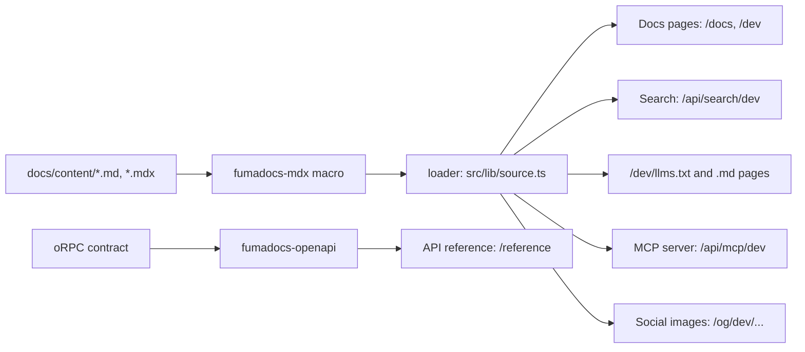

Todas las apps de Remy guardan su documentación de la misma manera, de modo que las tareas compartidas y la CLI de Fumadocs funcionan en cada una.
Hay dos sitios de documentación, servidos por el Worker de documentación (la app `docs/`, aparte del Worker de la app): la guía
para los usuarios de la app en `/docs`, y esta documentación para desarrolladores en `/dev`.
Cada uno tiene sus propios idiomas, búsqueda, `llms.txt` y carpeta de Ask AI.

## A quién se dirige cada parte [#who-each-part-is-for]

La documentación tiene tres partes, y cada una está escrita desde el punto de vista de un solo lector. El modo IA de Google, Gemini y cualquier
otro asistente solo las distinguen por lo que dicen las páginas, así que mantenlas separadas:

| Parte | Lector | Trata de | Nunca |
| --- | --- | --- | --- |
| Guía del producto, `content/users/` (`/docs`) | alguien que usa la app | lo que ve y hace en la app | código, herramientas, el repositorio, despliegues |
| Documentación para desarrolladores, `content/dev/` (`/dev`) | un desarrollador que construye Remy o una app sobre él | código, tareas, herramientas, reglas | cómo usar la app, más allá de un enlace a la guía |
| Referencia de la API (`/reference`) | un desarrollador que llama a la API | endpoints, generados a partir del contrato | prosa; está generada |

- Una página que necesita a la otra parte enlaza a ella en una sola línea («¿La estás construyendo? La documentación para desarrolladores.»).
- La página de inicio de cada parte empieza diciendo a quién se dirige; sus títulos terminan con el nombre de la parte (`docs.config.ts`,
  `titles`), y lo mismo ocurre con su `llms.txt` y su servidor MCP ([Documentación en tus herramientas de IA](./ai-tools.md)).
- Las partes, sus lectores, los archivos llms y los servidores MCP forman una sola lista, `src/lib/sections.ts`.

## Estructura [#layout]

<Files>
  <Folder name="docs/content" defaultOpen>
    <Folder name="users" defaultOpen>
      <File name="i18n.json" />
      <File name="meta.json" />
      <File name="index.mdx" />
      <File name="formats.mdx" />
    </Folder>
    <Folder name="dev">
      <File name="i18n.json" />
      <File name="meta.json" />
      <File name="index.md" />
      <File name="index.es.md" />
      <File name="writing-docs.mdx" />
    </Folder>
  </Folder>
</Files>

- `i18n.json` contiene los idiomas del sitio: `defaultLanguage` y `languages`. Las URL del sitio, el menú de idiomas,
  la búsqueda y las tareas de traducción lo leen. Las listas de los dos sitios difieren: la documentación para desarrolladores se traduce
  solo a los idiomas en los que ofrecemos soporte a desarrolladores.
- `meta.json` es la navegación del sitio: `pages` fija el orden, `"---Heading---"` inicia una sección
  y `"[Title](https://…)"` es un enlace externo.
- Una traducción está junto a su página: `index.es.md` junto a `index.md`, en `/dev/es/`.
- Las imágenes y vídeos de la guía están en `docs/public/media` y se referencian por URL (`/media/formats.png`); la documentación para desarrolladores tiene diagramas Mermaid y tablas de tipos;
  la referencia de la API es una sección propia en `/reference`, generada a partir del contrato de oRPC.

## Cómo llega una página al lector [#how-a-page-reaches-the-reader]



## Frontmatter [#frontmatter]

Toda página empieza con un título y una descripción. La descripción es el resumen de la página en los resultados
de búsqueda, en `llms.txt` y en las vistas previas de enlaces.

```md title="docs/content/users/formats.mdx"
---
title: "Formats"
description: "How dates, numbers, currency and direction change with the language you choose."
---
```

## Imágenes y vídeos [#pictures-and-videos]

:::note
Captúralos con la herramienta del propio proyecto, para que muestren la app real:
`mise run browser:shots -- /formats --out docs/public/media` para una imagen, y añade `--video`
para una grabación corta de la página.
:::

<Tabs items={['Picture', 'Video']}>
  <Tab value="Picture">
    ```md
    
    ```
    Fumadocs ajusta el tamaño, y al hacer clic se amplía.
  </Tab>
  <Tab value="Video">
    ```mdx
    <video src="/media/formats-tour.webm" controls muted playsInline preload="metadata" />
    ```
    Un vídeo requiere una página `.mdx` (es un elemento JSX).
  </Tab>
</Tabs>

## Componentes [#components]

En páginas `.mdx`: `<Callout>` (o `:::note`, `:::warning` en cualquier página), `<Cards>` y `<Card>`, `<Tabs>`
y `<Tab>`, `<Steps>` y `<Step>`, `<Accordions>` y `<Accordion>`, `<Files>`, `<Folder>` y
`<File>`, un diagrama ` ```mermaid ` y una tabla de tipos leída de nuestro TypeScript:

<auto-type-table path="../../src/docs/source.server.ts" name="DocsPageData" />

## La CLI de Fumadocs [#the-fumadocs-cli]

`mise run docs:cli -- feature <name>` ejecuta la CLI de Fumadocs fijada; su `cli.json` asigna nuestras carpetas, y
lo que escribe es un cambio que hay que revisar como cualquier otro.

| Función | Lo que aportó a este sitio |
| --- | --- |
| `llms` | `/<site>/llms.txt`, `/<site>/<lang>/llms-full.txt`, `/<site>/<lang>/<page>.md` |
| `mcp` | un servidor MCP por parte, `/api/mcp/docs`, `/api/mcp/dev`, `/api/mcp/reference` ([Documentación en tus herramientas de IA](./ai-tools.md)) |
| `og` | una imagen social por página |
| `webmcp` | la documentación como herramientas para agentes en el navegador |

## Traducciones [#translations]

La traducción está congelada hasta que lleguen las herramientas de traducción ([el plan](https://github.com/joeblew999/remy-auth/blob/main/.plans/translation-pipeline.md)).
`mise run i18n:status` enumera lo que aún necesita cada idioma.
