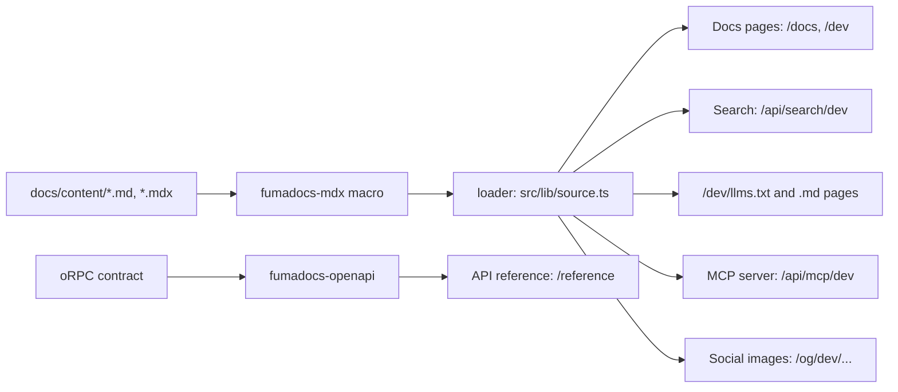

Every Remy app keeps its docs the same way, so the shared tasks and the Fumadocs CLI work in each one.
There are two docs sites, served by the docs Worker (the `docs/` app, apart from the app Worker): the guide
for the app's users at `/docs`, and these developer docs at `/dev`.
Each has its own languages, search, `llms.txt` and Ask AI folder.

## Layout

<Files>
  <Folder name="docs/content" defaultOpen>
    <Folder name="users" defaultOpen>
      <File name="i18n.json" />
      <File name="meta.json" />
      <File name="index.mdx" />
      <File name="formats.mdx" />
    </Folder>
    <Folder name="dev">
      <File name="i18n.json" />
      <File name="meta.json" />
      <File name="index.md" />
      <File name="index.es.md" />
      <File name="writing-docs.mdx" />
    </Folder>
  </Folder>
</Files>

- `i18n.json` is the site's languages: `defaultLanguage` and `languages`. The site's URLs, language menu,
  search and translation tasks all read it. The two sites' lists differ: developer docs are translated
  only into the languages we support developers in.
- `meta.json` is the site's navigation: `pages` sets the order, `"---Heading---"` starts a section,
  `"[Title](https://…)"` is a link out.
- A translation sits beside its page: `index.es.md` beside `index.md`, at `/dev/es/`.
- The guide's pictures and videos are in `docs/public/media`, referenced by URL (`/media/formats.png`); the developer docs have Mermaid diagrams and type tables;
  the API reference is its own section at `/reference`, made from the oRPC contract.

## How a page reaches the reader



## Frontmatter

Every page starts with a title and a description. The description is the page's summary in search
results, `llms.txt` and link previews.

```md title="docs/content/users/formats.mdx"
---
title: "Formats"
description: "How dates, numbers, currency and direction change with the language you choose."
---
```

## Pictures and videos

:::note
Take them with the project's own tool, so they show the real app:
`mise run browser:shots -- /formats --out docs/public/media` for a picture, and add `--video`
for a short recording of the page.
:::

<Tabs items={['Picture', 'Video']}>
  <Tab value="Picture">
    ```md
    
    ```
    Fumadocs sizes it, and a click enlarges it.
  </Tab>
  <Tab value="Video">
    ```mdx
    <video src="/media/formats-tour.webm" controls muted playsInline preload="metadata" />
    ```
    A video needs an `.mdx` page (it is a JSX element).
  </Tab>
</Tabs>

## Components

In `.mdx` pages: `<Callout>` (or `:::note`, `:::warning` in any page), `<Cards>` and `<Card>`, `<Tabs>`
and `<Tab>`, `<Steps>` and `<Step>`, `<Accordions>` and `<Accordion>`, `<Files>`, `<Folder>` and
`<File>`, a ` ```mermaid ` diagram, and a type table read from our TypeScript:

<auto-type-table path="../../src/docs/source.server.ts" name="DocsPageData" />

## The Fumadocs CLI

`mise run docs:cli -- feature <name>` runs the pinned Fumadocs CLI; its `cli.json` maps our folders, and
what it writes is a change to review like any other.

| Feature | What it gave this site |
| --- | --- |
| `llms` | `/<site>/llms.txt`, `/<site>/<lang>/llms-full.txt`, `/<site>/<lang>/<page>.md` |
| `mcp` | an MCP server per part, `/api/mcp/docs`, `/api/mcp/dev`, `/api/mcp/reference` ([Docs in your AI tools](./ai-tools.md)) |
| `og` | a social image per page |
| `webmcp` | the docs as tools for agents in the browser |

## Translations

Translation is frozen until the translation tools land ([the plan](https://github.com/joeblew999/remy-auth/blob/main/.plans/translation-pipeline.md)).
`mise run i18n:status` lists what each language still needs.
